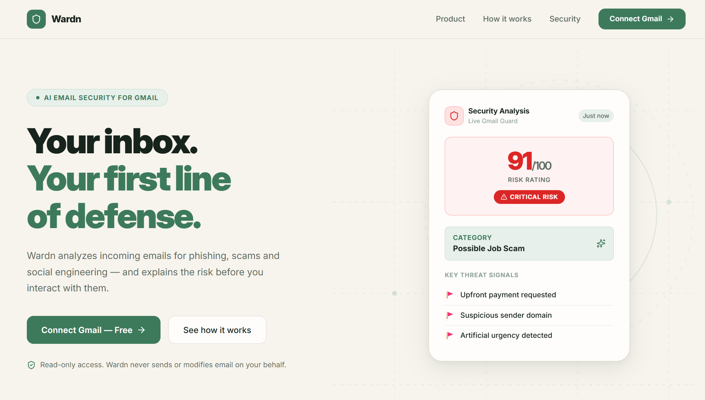
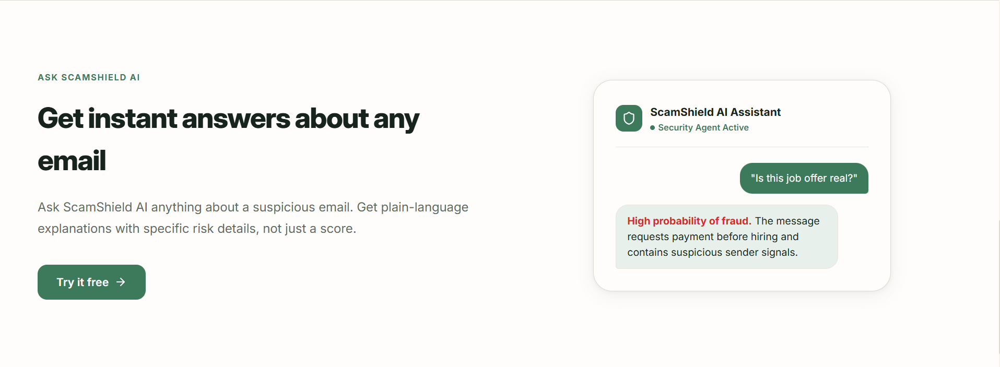
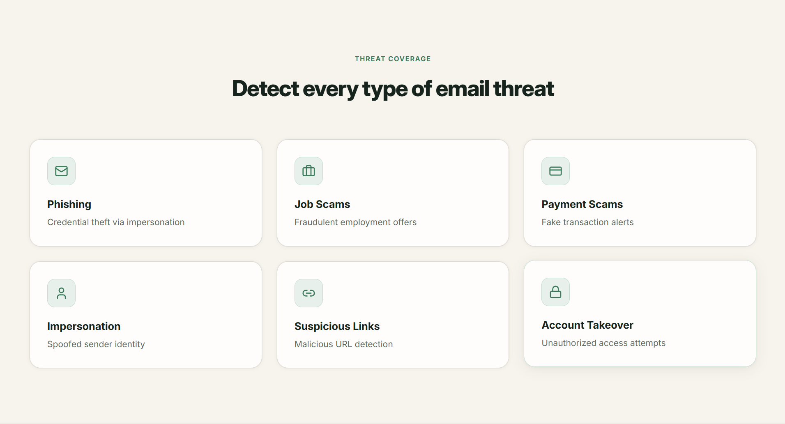

# 🛡️ Wardn

### AI-Assisted Email Security & Threat Detection Platform

<p align="center">
  Wardn connects to Gmail and analyzes incoming emails for phishing,
  scams, suspicious links, and social-engineering threats — helping users
  understand the risk before interacting with them.
</p>

<p align="center">
  <a href="#-why-wardn">Why Wardn</a> •
  <a href="#-features">Features</a> •
  <a href="#-how-it-works">How It Works</a> •
  <a href="#-tech-stack">Tech Stack</a> •
  <a href="#-installation">Installation</a> •
  <a href="#-security--privacy">Security</a> •
  <a href="#-roadmap">Roadmap</a>
</p>

---

## 🖥️ Product Preview

<p align="center">
  
</p>

---

## 🧭 Why Wardn?

Email remains one of the most common entry points for phishing, fraud,
credential theft, impersonation, and social-engineering attacks.

Traditional email security often presents users with a simple warning or
classification. Wardn takes a more explainable approach by analyzing
multiple threat signals and presenting users with a security investigation
that explains **why an email may be dangerous**.

Wardn is designed as a security layer between the user and potentially
malicious email interactions.

---

## ✨ Features

### 📧 Gmail Integration

* Google OAuth 2.0 authentication
* Read-only Gmail access
* Real inbox synchronization
* Manual Gmail synchronization
* Automatic email importing
* Sender and email metadata extraction

### 🔍 Threat Detection

Wardn analyzes emails for multiple security signals, including:

* Phishing indicators
* Scam patterns
* Suspicious links
* Social-engineering signals
* Account takeover attempts
* Credential harvesting
* Financial and payment requests
* Suspicious sender domains
* Artificial urgency
* Suspicious billing activity

### 🎯 Risk Scoring

Each analyzed email receives a security risk score from:

**0 → 100**

Emails are classified into four security levels:

* 🟢 Safe
* 🟡 Suspicious
* 🟠 High Risk
* 🔴 Critical Risk

### 🧠 Security Intelligence

Each analyzed email can provide:

* Risk score
* Severity level
* Threat category
* Confidence level
* Security explanation
* Detected threat indicators
* Recommended action

### 🤖 Wardn Assistant

Users can ask questions about suspicious emails and receive
plain-language security explanations.

<p align="center">
  
</p>

The assistant is designed to help users understand security signals instead
of relying only on a numerical risk score.

### 📊 Security Dashboard

The dashboard provides an overview of inbox security, including:

* Protection score
* Emails scanned
* Suspicious emails
* Threats detected
* Guard status
* Overall security health

### 📬 Email Investigation

Users can inspect individual emails and view:

* Sender information
* Email subject
* Email content
* Security investigation report
* Risk score
* Threat category
* Detected threat indicators
* Security intelligence explanation

---

## 🛡️ Threat Coverage

Wardn is designed to identify multiple categories of email-based threats:

<p align="center">
  
</p>

| Threat Category  | Example                                |
| ---------------- | -------------------------------------- |
| Phishing         | Credential theft through impersonation |
| Job Scams        | Fraudulent employment offers           |
| Payment Scams    | Fake transaction or payment requests   |
| Impersonation    | Spoofed sender identity                |
| Suspicious Links | Potentially malicious URLs             |
| Account Takeover | Attempts to obtain account credentials |

---

## ⚙️ How It Works

```text
                    Gmail Inbox
                         │
                         ▼
                 Google OAuth 2.0
                         │
                         ▼
                     Gmail API
                         │
                         ▼
                  Email Sync Engine
                         │
                         ▼
                  Security Analyzer
                         │
              ┌──────────┼──────────┐
              ▼          ▼          ▼
         Risk Scoring  Threat    Security
                      Detection  Explanation
              │          │          │
              └──────────┼──────────┘
                         ▼
                 Wardn Dashboard
                         │
                         ▼
                 Email Investigation
```

### Application Flow

```text
Connect Gmail
      ↓
Google Authorization
      ↓
Read-Only Gmail Permission
      ↓
Inbox Synchronization
      ↓
Email Analysis
      ↓
Threat Detection
      ↓
Risk Classification
      ↓
Security Dashboard
      ↓
Detailed Email Investigation
```

---

## 🏗️ System Architecture

```text
┌──────────────────────────────┐
│        React Frontend        │
│                              │
│ Dashboard • Inbox • Reports │
│ Security Analysis • Settings│
└──────────────┬───────────────┘
               │
               │ REST API
               ▼
┌──────────────────────────────┐
│       FastAPI Backend        │
│                              │
│ API Routes • Authentication  │
│ Email Processing • Analyzer  │
└──────────────┬───────────────┘
               │
       ┌───────┴────────┐
       ▼                ▼
┌─────────────┐  ┌──────────────┐
│ Gmail API   │  │   SQLite DB  │
│             │  │              │
│ Email Data  │  │ Threat Data  │
└─────────────┘  └──────────────┘
```

---

## 💻 Tech Stack

| Layer           | Technology       |
| --------------- | ---------------- |
| Frontend        | React            |
| Build Tool      | Vite             |
| Styling         | CSS              |
| Backend         | Python           |
| API Framework   | FastAPI          |
| Database        | SQLite           |
| ORM             | SQLAlchemy       |
| Authentication  | Google OAuth 2.0 |
| Email API       | Gmail API        |
| Server          | Uvicorn          |
| Version Control | Git + GitHub     |

---

## 📁 Project Structure

```text
Wardn/
│
├── backend/
│   ├── analyzer.py
│   ├── database.py
│   ├── gmail_service.py
│   ├── main.py
│   ├── models.py
│   ├── schemas.py
│   ├── seed.py
│   ├── requirements.txt
│   └── credentials.example.json
│
├── docs/
│   ├── hero.png
│   ├── ai-assistant.png
│   └── threat-coverage.png
│
├── public/
│   ├── favicon.svg
│   └── icons.svg
│
├── src/
│   ├── api/
│   │   └── scamShieldApi.js
│   │
│   ├── components/
│   │   ├── layout/
│   │   └── ui/
│   │
│   ├── pages/
│   │   ├── ConnectPage.jsx
│   │   ├── Dashboard.jsx
│   │   ├── Inbox.jsx
│   │   └── ...
│   │
│   ├── assets/
│   ├── App.jsx
│   ├── App.css
│   ├── index.css
│   └── main.jsx
│
├── .gitignore
├── Gmail_SETUP.md
├── INTEGRATION_STATUS.md
├── README.md
├── index.html
├── package.json
├── package-lock.json
└── vite.config.js
```

---

## 🚀 Installation

### 1. Clone the repository

```bash
git clone https://github.com/KrishivSharma45/Wardn-AI.git
cd Wardn-AI
```

### 2. Install frontend dependencies

```bash
npm install
```

### 3. Install backend dependencies

Open a terminal inside the `backend` folder:

```bash
cd backend
pip install -r requirements.txt
```

### 4. Configure Gmail OAuth

Create a Google OAuth Desktop application and download the credentials file.

Place the credentials file inside:

```text
backend/credentials.json
```

> ⚠️ Never upload `credentials.json` or `token.json` to GitHub.

### 5. Start the backend

From the `backend` directory:

```bash
py -m uvicorn main:app --host 127.0.0.1 --port 8000
```

The backend will run at:

```text
http://127.0.0.1:8000
```

FastAPI documentation is available at:

```text
http://127.0.0.1:8000/docs
```

### 6. Start the frontend

Open another terminal in the project root:

```bash
npm run dev
```

The frontend will normally run at:

```text
http://localhost:5174
```

---

## 🔐 Gmail OAuth Flow

```text
User
 │
 ▼
Wardn Connect Page
 │
 ▼
Google OAuth Authorization
 │
 ▼
Read-Only Gmail Permission
 │
 ▼
Gmail API
 │
 ▼
Wardn Backend
 │
 ▼
Email Synchronization
 │
 ▼
Security Analysis
 │
 ▼
Dashboard
```

Wardn requests Gmail read-only access so that emails can be retrieved
and analyzed for security purposes.

---

## 🛡️ Security & Privacy

Wardn follows a **read-only security model**.

### Wardn can:

* ✅ Read emails for security analysis
* ✅ Analyze sender information
* ✅ Analyze email content
* ✅ Detect suspicious activity
* ✅ Generate security reports

### Wardn cannot:

* ❌ Send emails
* ❌ Delete emails
* ❌ Modify emails
* ❌ Reply to emails

Sensitive OAuth files are excluded from Git version control through
`.gitignore`.

The following files should never be committed:

```text
backend/credentials.json
backend/token.json
backend/*.db
```

> 🔒 Always review `.gitignore` and repository contents before pushing
> credentials or other sensitive information.

---

## 📊 Example Security Analysis

A suspicious email may produce an investigation such as:

```text
Risk Score: 70 / 100

Severity: HIGH RISK

Category:
Account Takeover

Threat Indicators:
• Upfront Payment / Financial Request
• Credential / Identity Harvesting Attempt
• Suspicious Link

Security Recommendation:
Avoid interacting with embedded links
or replying to the email.
```

The investigation view allows users to understand the detected threat instead
of simply receiving a warning.

---

## 🎯 Project Goals

Wardn was built to explore the intersection of:

* 🔐 Cybersecurity
* 📧 Email threat detection
* 🤖 AI-assisted security analysis
* 🔑 OAuth authentication
* 🔌 API integration
* 🎯 Risk scoring
* 📊 Security dashboards
* 🛡️ Threat intelligence

The primary goal is to make complex email security signals easier for users
to understand and act upon.

---

## 🔮 Roadmap

Future improvements planned for Wardn include:

* 🤖 Machine-learning-based phishing classification
* 🔗 Advanced URL reputation analysis
* 🌐 Domain intelligence
* 📸 Malicious webpage analysis
* 🧩 Browser extension
* ⚡ Real-time inbox monitoring
* 🔔 Real-time threat notifications
* 📈 Advanced security analytics
* 🧠 Improved threat classification
* 📊 Historical security trends

---

## ⚠️ Disclaimer

Wardn is a cybersecurity prototype intended for educational,
research, and demonstration purposes.

Security analysis should not be treated as a guarantee that an email is
safe or malicious.

Always exercise caution when interacting with suspicious emails, links,
attachments, or requests for sensitive information.

---

## 👨‍💻 Author

**Krishiv Sharma**

B.Tech CSE — Cybersecurity

Interested in:

**Cybersecurity • Software Engineering • AI • Threat Detection**

---

<p align="center">
  Built with a focus on
  <b>Cybersecurity • AI • Email Security • Threat Detection</b>
</p>

<p align="center">
  ⭐ If you found Wardn interesting, consider starring the repository.
</p>
